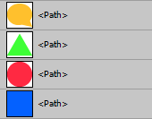
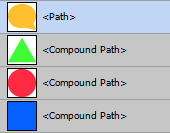

# Android 5 VectorDrawable

### VectorDrawable != SVG

XXX

### 优点和缺点

XXX

### VectorDrawable可以实现什么图形

XXX

### AnimatedVectorDrawable

XXX

## 使用Illustrator导出SVG

### Save as SVG(另存为SVG)

从Illustrator导出SVG的各种方法可参考网上的教程或者官方文档, 这里主要介绍如何保存出最适合转换为Android VectorDrawable的SVG文件.

菜单"File" - "Save As...", 从"保存类型"下拉菜单中选择"SVG (*.SVG)", 如果你将每个图标都放置在各自的Artboard(画板)上, 这时就需要选中"Use Artboards"选项, 并且选择导出全部画板或者特定画板编号.

> 使用类似"1-8"的数字表示导出编号为1至8之间的8个画板. 导出特定的画板使用","隔开多个画板编号, 例如"1,8"表示导出编号1和8的2个画板.

SVG Options对话框的设置参考下图.


**SVG Profiles**: 选择"SVG 1.1".  
**Fonts**: 如果图标包含字体可以选择"Convert to outline"转换为轮廓, 或者在导出前转为轮廓.  
**Options**: Android VectorDrawable不支持SVG的图片链接或嵌入图片, 所以这个设置保持默认. 尽量不要图标中包含图片和位图元素.  
**Advanced Options - CSS Properties**: 选择"Presentation Attributes".  
**Advanced Options - Decimal Places**: 小数点位置使用2或3.  
**Advanced Options - Encoding**: 必须选择"Unicode (UTF-8)".  

> 使用这种另存为SVG的方式, 软件会按"icons\_画板名.svg"的命名方式导出文件, 未命名画板按照"icons\_画板编号.svg"的命名方式导出. 这种方式导出的文件可能需要批量重命名.

### Compound Path(复合路径)

VectorDrawable需要的只是SVG path元素上部分属性的值, 而大部分软件生成的SVG都会按照SVG规范sh生成代码, 这时圆形(circle), 矩形(rect), 直线(line), 多边形(polygon)等都不使用path标签, 所以无法获得VectorDrawable需要的pathData.



如上图生成的SVG为:

```XML
<rect x="3" y="3" fill="#0461FF" width="12" height="12"/>
<circle fill="#FF2942" cx="23" cy="9" r="6"/>
<polygon fill="#3EFF36" points="2,29 9.5,16 17,29 "/>
<path fill="#FFC02D" d="M22.5,17c3.59,0,6.5,2.49,6.5,5.55c0,1.22-0.46,2.35-1.25,3.27L28.96,29l-5.12-1.09 c-0.53,0.02-1.13,0.15-1.73,0.17c-0.07,0-0.14,0-0.2,0c-3.48,0-5.9-2.53-5.9-5.53C16,19.49,18.91,17,22.5,17"/>
```
转换成Compound Path可以让元素使用path标签，所以在设计过程中必须将元素转换成Compound Path.



转换之后的SVG为:

```XML
<path fill="#0461FF" d="M15,15H3V3h12V15z"/>
<path fill="#FF2942" d="M29,9c0,3.31-2.69,6-6,6s-6-2.69-6-6s2.69-6,6-6S29,5.69,29,9z"/>
<path fill="#3EFF36" d="M2,29l7.5-13L17,29H2z"/>
<path fill="#FFC02D" d="M22.5,17c3.59,0,6.5,2.49,6.5,5.55c0,1.22-0.46,2.35-1.25,3.27L28.96,29l-5.12-1.09 c-0.53,0.02-1.13,0.15-1.73,0.17c-0.07,0-0.14,0-0.2,0c-3.48,0-5.9-2.53-5.9-5.53C16,19.49,18.91,17,22.5,17"/>
```
> 非全部由直线构成的复杂路径可以不需要转换. 建议尽量把所有元素都转换为复合路径.

### Group(分组)和命名

组合在导出的SVG代码中，会生成"g"标签, 相当于VectorDrawable的"group"标签.

被重新命名的路径在导出的SVG代码中, 会在该路径的标签加上"id"属性. "id"属性可以在后期自动转成VectorDrawable时替换为"android:name"属性. 

> 在整个Ai文件中如果有重复的命名会导出导出的SVG中的"id"属性, 带有类似"_1_"的数字后缀. 带"_"符号时会被替换为"_x5F_". "group"标签可以给路径增加旋转, 位移, 缩放等效果. group和name可以让开发人员在需要的时候文件上自行添加, 不是导出SVG必须要的元素, 但合理的命名和分组可以让SVG代码更具可读性. 

### Artboard(画板)

建议以画板的形式来设计图标, 将每个图标放置到各自的画板内, 画板的大小为导出后文件的尺寸. 画板工具非常难调整位置和大小, 并且有可能出现非整数的坐标, 导致图像边缘模糊, 尽量不要直接用画板工具在文档上新建画板, 或者复制已有画板. 建议先用画矩形, 排列好之后再将矩形转为画板.

> 选择一个或多个矩形, 从菜单"Object" - "Artboards" - "Convert to Artboard", 将矩形转为画板时要注意矩形的坐标尽量对齐像素. 

可以通过Script处理非矩形和未对齐像素对象转为画板问题，Script将自动获得选中对象的整数坐标, 并在这个坐标上新建画板, 同时删除选中对象.

scripts/convert_selected_to_artboards.jsx  
```javascript
var selectedObjects = activeDocument.selection;
for(var i = 0; i < selectedObjects.length; i ++) {
    var rect = [];
    for(var j = 0; j < selectedObjects[i].controlBounds.length; j ++) {
        rect.push(Math.round(selectedObjects[i].controlBounds[j]));
    }
    activeDocument.artboards.add(rect);
    selectedObjects[i].remove();
}
```

另存为SVG的方式可以导出所有画板或者特定的画板, 但是文件命名不可控制. scripts/export_artboards_to_svg.jsx(界面如下图)可以导出所有或者选中的画板, 并以画板名作为最终的文件名.


**Export Folder**: 选择导出文件夹, 默认文件将保持在Ai文件上一级下的svg目录内.  
**Export All Artboards**: 确定是否导出所有画板.  
**Export Selected Artboards**: 不导出所有画板时, 该列表将可以操作, 处于选中状态的画板将会被导出.  

> VectorDrawable不需要同位图资源那样为不同DPI屏幕导出不同尺寸资源, 尽量以MDPI的标准尺寸设计图标, 这种尺寸的"px"可以直接等价于"dp"值. 另外尺寸越大会导致pathData数据比小尺寸更大.

## 使用Photoshop

## 使用Sketch

## 资源


Android SVG to VectorDrawable (Alpha) http://inloop.github.io/svg2android/  
简易的网页版转换工具, 无法处理width/height和viewportWidth/viewportHeight数组不同的状态.

poly2path http://semisignal.com/?p=3042

http://raphaeljs.com/